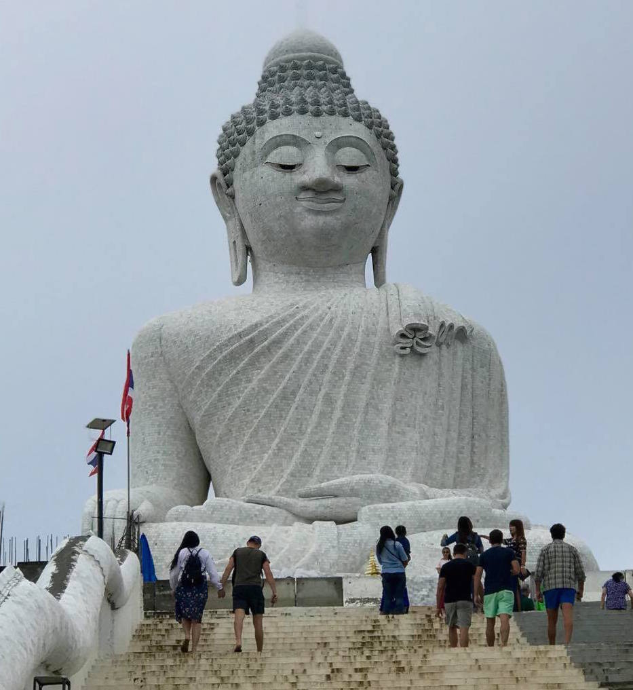

# Overall Thailand Trip

### Phuket

> Phuket was the first destination. Beautiful area which was full of tourism. While in Phuket, we were able to explore Patonga Beach and see the Big Budha. The Big Buddha is the **god** that the locals worship. Along with the Buddha, there were many other gods and monks within the area. Shortly after, we began our journey to Krabi!

### Krabi

> While in Krabi, we got to explore the hot and popular Phi Phi Islands. This was a tour that we will never forget. We were able to see 7 different islands along with seeing crazy monkeys! Next stop, Chiang Mai!

### Chiang Mai

> We stayed the [Chai Lai Orchid](https://www.chailaiorchid.com/chai-lai-orchid/) Santurary for elephants. This establishment was originally found for Thai women who have expierenced domestic violence and are attempting to regain control of thier lifes. Along with saving women, this place saves elephants who have underwent cruelty from [trekking](https://www.telegraph.co.uk/expat/expatlife/11048530/The-dark-side-of-animal-tourism-in-Thailand.html "click here to learn more about trekking"). Also, they save cats and dog whom were abandonded in the streets of Thailand. This place is definietly a must go to help support the local women within the community and to say no to trekking. Last stop, Bangkok!

### Bangkok

> Bangkok is our last stop in our trip. The city is full of culture and different people everywhere. The Thai people were so friendly and helpful than expected. Unfortunalty, there was only time to explore the night life. This trip was an unforgetable trip. 

---

 [HOME](https://jlveliz3.github.io "this will take you back to my homepage")
 [BIO](https://jlveliz3.github.io/bio)
